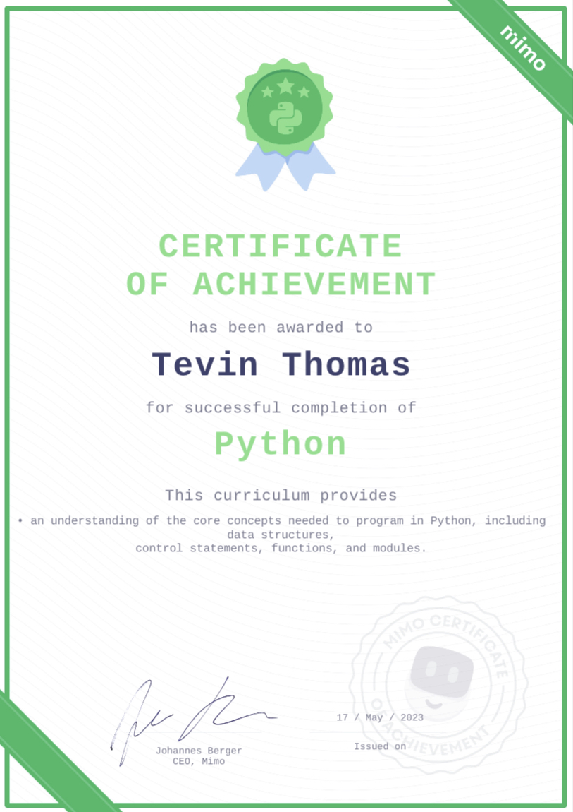
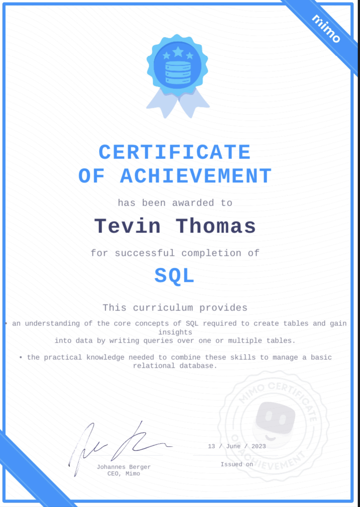

## Introduction

This repository serves as evidence of my successful completion of the Python and SQL courses offered by Mimo. Throughout the Python course, I gained a solid understanding of the language and learned various concepts and techniques that form the core of Python programming. From basic syntax to more advanced topics like object-oriented programming, I explored a wide range of Python's capabilities.

Additionally, the SQL course provided me with a comprehensive understanding of structured query language. I learned how to design and manipulate databases, execute complex queries, and optimize database performance. 

### Course Name: Python Programming

<b>Certificate of Completion:</b>

### Course Content

The course covered a wide range of topics, including but not limited to:

1. Python Basics
2. Types and Comparisons
3. Conditional Statements
4. Loops
5. Organizing Data
6. Using Lists
7. Using Strings
8. Intermediate Python
9. Functions
10. Tuples, Dictionaries, and Sets
11. List Comprehensions
12. Classes
13. Object-oriented Programming
14. Modules
15. Errors and Exceptions

### Course Name: SQL Programming 

### Course Content

1. SQL Basics
2. Table Management 
3. Filters
4. Aggregate Functions
5. Joins 
6. Subqueries

